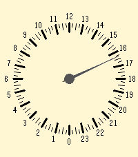
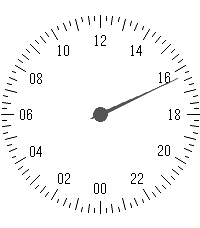
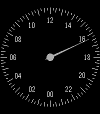

# Sakta

24-hour one-hand watchface for Pebble Time 2 (emery, 200x228), inspired by
the slow Jo 17 and slow Mo 02 from slow watches. Cream dial, quarter-hour
ticks along the edge, even-hour numerals (00-22) inside them with 12 (noon)
at the top and 00 (midnight) at the bottom, and one thin grey hand that turns
once a day.

| Cream (default) | White | Black |
|---|---|---|
|  |  |  |

## Settings

Phone app, gear icon on the watchface:

- Dial colour: cream (default), white or black. Black uses white marks and a
  light grey hand.

## Build and install

```
pebble build
pebble install --emulator emery
pebble install --phone <phone ip>     # developer connection on in the Pebble app
```

The bundle is `build/sakta.pbw`; it can also be sideloaded from the phone.

## Store listing

The appstore description is in `DESCRIPTION.txt`.
